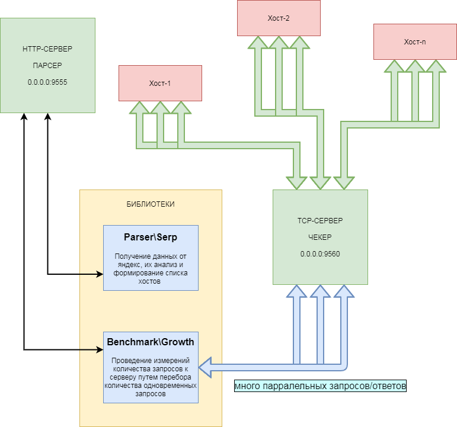

# Hello



### Start APP

```shell
docker-compose up --build
```

### Get APP

```http request
http://127.0.0.1:9555/sites?search=playstation купить
```

### Output data json

```json
{
  "https://wallpaperscraft.ru/": 7,
  "https://fonwall.ru/": 8,
  "https://www.goodfon.ru/": 15,
  "https://www.wildberries.ru/": 4,
  "https://million-wallpapers.ru/": 10,
  "https://nicefon.ru/": 8,
  "https://leroymerlin.ru/": 1,
  "https://7fon.org/": 11,
  "https://www.ozon.ru/": 1,
  "https://akspic.ru/": 5,
  "https://oboida.ru/": 11,
  "https://www.pexels.com/": 0,
  "https://pixabay.com/": 0,
  "https://www.1zoom.ru/": 13,
  "https://7themes.su/": 6,
  "https://wallbox.ru/": 21,
  "https://oboi-ma.ru/": 8,
  "https://www.fonstola.ru/": 18,
  "https://m.vk.com/": 13,
  "https://www.zastavki.com/": 11,
  "https://ua/": 0,
  "https://www.artfile.ru/": 11,
  "https://www.sunhome.ru/": 11,
  "https://www.obi.ru/": 0,
  "https://stroitelstvo.expert/": 0,
  "https://www.pinterest.ru/": 3,
  "https://oboiki.net/": 0,
  "https://zen.yandex.ru/": 0,
  "https://www.badfon.ru/": 10,
  "https://wallpapers.99px.ru/": 5,
  "https://oboi7.com/": 6,
  "https://oboi.ru/": 3,
  "https://oboi-store.ru/": 3,
  "https://trizio.ru/": 3,
  "https://getwall.ru/": 0,
  "https://artfile.me/": 21,
  "https://dom-decora.ru/": 0,
  "https://wallpapershome.ru/": 6,
  "https://www.oboilux.ru/": 4,
  "https://nastol.net/": 21,
  "https://wallperz.com/": 10
}
```

### Install Docker

```shell
apt update
apt install -y apt-transport-https ca-certificates curl gnupg-agent software-properties-common zip unzip

curl -fsSL https://download.docker.com/linux/debian/gpg | apt-key add -
add-apt-repository "deb [arch=amd64] https://download.docker.com/linux/debian $(lsb_release -cs) stable"
apt update

#/etc/init.d/docker stop
#apt purge -y docker-ce docker-ce-cli containerd.io
apt install -y docker-ce docker-ce-cli containerd.io

rm -rf /usr/bin/docker-compose
rm -rf /usr/local/bin/docker-compose
curl -L "https://github.com/docker/compose/releases/download/1.29.2/docker-compose-$(uname -s)-$(uname -m)" -o /usr/local/bin/docker-compose
chmod +x /usr/local/bin/docker-compose
ln -s /usr/local/bin/docker-compose /usr/bin/docker-compose

docker-compose up --build --force-recreate
```

```shell
docker-compose exec revo-parser bash
```